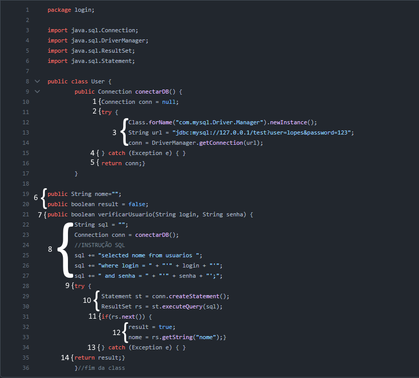
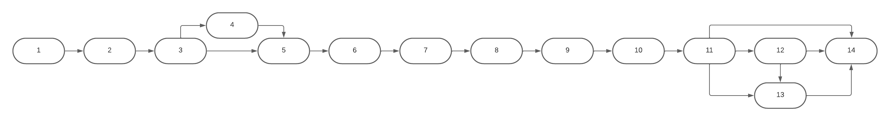

# Caixa_Branca
### Aluno: Vinícius, 211559
## Análise do código.
### A DOCUMENTAÇÃO FOI DESCRITA NO CÓDIGO?
1. A documentação foi descrita, mas de maneira rasa que não é o esperado. Seria interessante que a class user tivesse algum comentário documentando melhor, por exemplo.
### A ARQUITETURA UTILIZADA FOI DEVIDAMENTE RESPEITADA?
#### Erros na consulta do SQL.
1. O código concatena as strings na consulta, o que fragiliza a estrutura e a deixa vulnerável para invasões. Sugere-se que se use o PreparedStatement para isso.
2. Na linha 25 a consulta dará erro porque está incorreta. O certo é usar a palavra "SELECT" ao invés do "selected".
### AS VARIÁVEIS E CONSTANTES POSSUEM BOA NOMENCLATURA?
1. Possuem.
### EXISTEM LEGIBILIDADE E ORGANIZAÇÃO NO CÓDIGO?
#### Existe algo bem básico, espera-se melhoras.
1. Os nomes das variáveis são bons, ponto já ressaltado. 
2. As chaves que fecham a classe ficam melhores colocadas em linha vazia, abaixo da ultima linha de código.
3. Não há comentários. Deveriam haver mais comentários explicando o código, ponto já levantado no início desta análise.
4. Carece de modulação, o código está tudo em uma única classe. Seria interessante descentralizar melhor isso.
### TODOS OS NULLPOINTERS FORAM TRATADOS?
#### Há exceções vazias.
1. O código dentro dos blocos "catch" está vazio. Deve ser feito um tratamento adequado.
### AS CONEXÕES UTILIZADAS FORAM FECHADAS?
#### 
1. Não há o fechamento esperado do recurso Connection. 
2. Não há o fechamento esperado do recurso Statement.
3. Não há o fechamentoe sperado do recurso ResultSet.

# Fluxo do Código Fonte
## Extração de dados: 

## Grafo de Fluxograma:

### Cálculo da Complexidade Ciclomática
V(G) = 4 REGIÕES.

V(G) = 17 ARESTAS.

V(G) = 14 NÓS.

CÁLCULO: V(G) = (ARESTAS – NÓS) + 2 = 5
### Conjunto Base de Caminhos
CAMINHO 1  = 1; 2; 3; 5; 6; 7; 8; 9; 10; 11; 12; 14.

CAMINHO 2 = 1; 2; 3; 5; 6; 7; 8; 9; 10; 11; 14.

CAMINHO 3 = 1; 2; 3; 5; 6; 7; 8; 9; 10; 11; 13; 14.

CAMINHO 4 = 1; 2; 3; 5; 6; 7; 8; 9; 10; 11; 12; 13; 14.

CAMINHO 5 = 1; 2; 3; 4; 5; 6; 7; 8; 9; 10; 11; 12; 14.

CAMINHO 6 = 1; 2; 3; 4; 5; 6; 7; 8; 9; 10; 11; 14. 

CAMINHO 7 = 1; 2; 3; 4; 5; 6; 7; 8; 9; 10; 11; 13; 14. 

CAMINHO 8 = 1; 2; 3; 4; 5; 6; 7; 8; 9; 10; 11; 12; 13; 14. 

TOTAL DE CAMINHOS: 8.
## Última atualização: 05/10/2023
